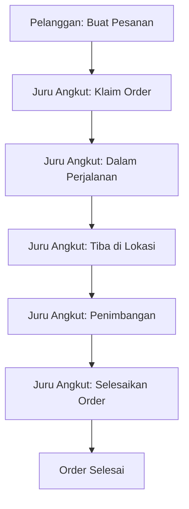
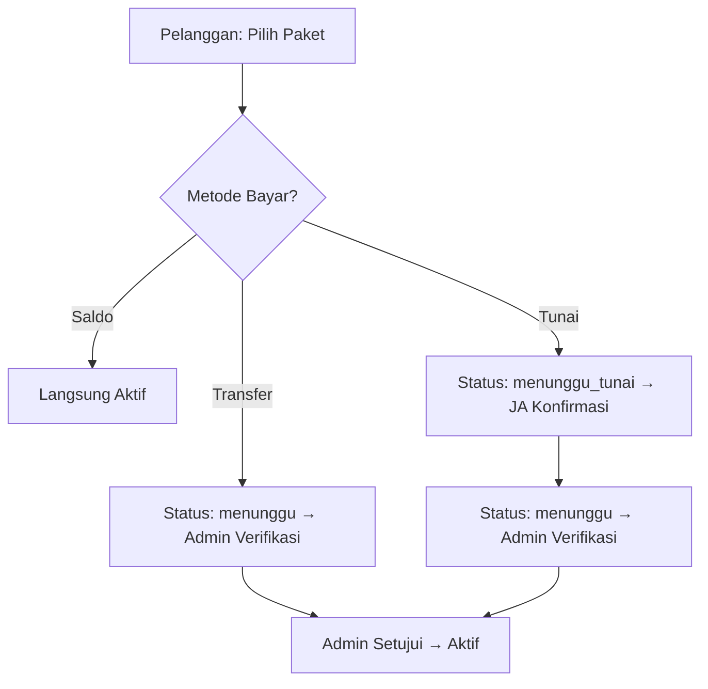
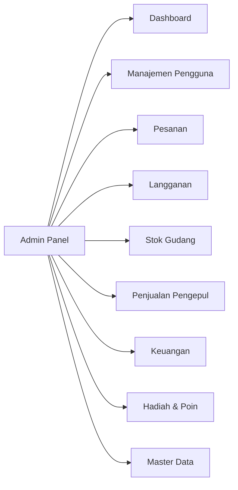

# 📊 Analisa Alur, Menu Admin & Kebutuhan Migration

---

## 1. Analisa Alur & Perubahan Database

### 1.1 Alur Jemput Sampah (Pesanan Reguler)

| Tahap | Aksi | Tabel & Operasi |
|-------|------|-----------------|
| **Pelanggan buat pesanan** | Isi form jemput sampah, pilih jenis & metode bayar | `INSERT` → **pesanan** (status=`menunggu`, user_id, alamat, tanggal, biaya_jemput, metode_pembayaran) |
| | | `INSERT` → **detail_pesanan** (per jenis sampah: kategori_sampah_id, berat estimasi, harga_per_kg, subtotal) |
| | Jika metode=saldo | `UPDATE` → **users** (saldo dipotong) |
| | Upload bukti transfer | `UPDATE` → **pesanan** (bukti_pembayaran=path file) |
| **JA klaim order** | Terima pesanan | `UPDATE` → **pesanan** (status=`diklaim`, pengangkut_id=JA.id, diklaim_pada=now) |
| **JA dalam perjalanan** | Update status | `UPDATE` → **pesanan** (status=`dalam_perjalanan`) |
| **JA tiba** | Update status | `UPDATE` → **pesanan** (status=`tiba`) |
| **JA penimbangan** | Input berat aktual | `UPDATE` → **pesanan** (status=`penimbangan`) |
| | | `UPDATE` → **detail_pesanan** (berat, subtotal dihitung ulang) |
| **JA selesaikan** | Finalisasi order | `UPDATE` → **pesanan** (status=`selesai`, total_berat, total_pendapatan, poin_didapat, komisi_pengangkut, bagian_perusahaan, diselesaikan_pada) |
| | Saldo masuk ke pelanggan | `UPDATE` → **users** pelanggan (saldo + total_pendapatan, poin + poin_didapat) |
| | Komisi masuk ke JA | `UPDATE` → **users** juru_angkut (saldo + komisi_pengangkut) |
| | Catat transaksi | `INSERT` → **transaksi** (2 record: 1 untuk pelanggan tipe=`masuk`, 1 untuk JA tipe=`komisi`) |

---

### 1.2 Alur Langganan

| Tahap | Aksi | Tabel & Operasi |
|-------|------|-----------------|
| **Pilih paket + bayar saldo** | Saldo dipotong, langsung aktif | `UPDATE` → **users** (saldo dikurangi) |
| | | `INSERT` → **langganan** (status=`aktif`, metode=`saldo`, tanggal_mulai/selesai diisi, disetujui_pada=now) |
| | | `INSERT` → **transaksi** (tipe=`keluar`, status=`selesai`) |
| **Pilih paket + transfer** | Upload bukti, menunggu admin | `INSERT` → **langganan** (status=`menunggu`, metode=`transfer`, bukti_pembayaran=path) |
| | | `INSERT` → **transaksi** (tipe=`keluar`, status=`menunggu`) |
| **Pilih paket + tunai** | Menunggu JA konfirmasi cash | `INSERT` → **langganan** (status=`menunggu_tunai`, metode=`tunai`) |
| | | `INSERT` → **transaksi** (tipe=`keluar`, status=`menunggu`) |
| **JA konfirmasi tunai** | JA terima uang cash | `UPDATE` → **langganan** (status `menunggu_tunai` → `menunggu`) |
| **Admin setujui** | Admin verifikasi | `UPDATE` → **langganan** (status=`aktif`, tanggal_mulai/selesai diisi, disetujui_pada, disetujui_oleh) |
| | | `UPDATE` → **transaksi** (status=`selesai`) |
| **Pelanggan batalkan** | Batal sebelum aktif | `UPDATE` → **langganan** (status=`dibatalkan`) |
| | | `UPDATE` → **transaksi** (status=`dibatalkan`) |
| | Jika saldo → refund | `UPDATE` → **users** (saldo dikembalikan) |

---

### 1.3 Alur Stok Gudang & Penjualan ke Pengepul

| Tahap | Aksi | Tabel & Operasi |
|-------|------|-----------------|
| **Order selesai** | Sampah masuk gudang | `UPDATE` → **stok_gudang** (stok_kg + berat, total_masuk + berat) |
| | | `INSERT` → **log_stok_gudang** (tipe=`masuk`, sumber=Pesanan) |
| **Admin jual ke pengepul** | Buat invoice penjualan | `INSERT` → **penjualan_pengepul** (pembeli_id=pengepul, admin_id, total_berat, total_harga) |
| | | `INSERT` → **detail_penjualan_pengepul** (per kategori: berat, harga_per_kg, subtotal) |
| | Stok berkurang | `UPDATE` → **stok_gudang** (stok_kg − berat, total_keluar + berat) |
| | | `INSERT` → **log_stok_gudang** (tipe=`keluar`, sumber=PenjualanPengepul) |

---

### 1.4 Alur Penarikan Saldo & Hadiah Poin

| Tahap | Tabel & Operasi |
|-------|-----------------|
| **User ajukan penarikan** | `INSERT` → **penarikan** (status=`menunggu`, jumlah, metode, rekening) |
| **Admin setujui** | `UPDATE` → **penarikan** (status=`disetujui`/`selesai`, disetujui_oleh, disetujui_pada) |
| | `UPDATE` → **users** (saldo dikurangi) |
| | `INSERT` → **transaksi** (tipe=`keluar`, status=`selesai`) |
| **User klaim hadiah** | `INSERT` → **klaim_hadiah** (status=`menunggu`, poin_digunakan) |
| | `UPDATE` → **users** (poin dikurangi) |
| **Admin proses hadiah** | `UPDATE` → **klaim_hadiah** (status=`disetujui`/`dikirim`/`ditolak`) |
| | `UPDATE` → **hadiah** (stok dikurangi jika disetujui) |

---

## 2. Struktur Menu Admin Panel

### 📌 2.1 Dashboard
> Halaman utama berisi ringkasan statistik

| Fitur | Sumber Data |
|-------|-------------|
| Total pesanan hari ini / bulan ini | `pesanan` (COUNT + GROUP BY status) |
| Pendapatan perusahaan hari ini | `pesanan` (SUM bagian_perusahaan WHERE selesai) |
| Jumlah pelanggan & juru angkut aktif | `users` (COUNT BY role) |
| Langganan menunggu verifikasi | `langganan` (COUNT WHERE status=menunggu) |
| Penarikan menunggu approval | `penarikan` (COUNT WHERE status=menunggu) |
| Grafik tren pesanan mingguan | `pesanan` (GROUP BY tanggal) |
| Stok gudang terkini | `stok_gudang` (JOIN kategori_sampah) |

---

### 📌 2.2 Manajemen Pengguna
> CRUD user, khususnya pendaftaran Juru Angkut

| Fitur | Fungsi | Operasi DB |
|-------|--------|-----------|
| **Daftar Pelanggan** | List semua pengguna role=`pengguna` | `SELECT` users |
| **Daftar Juru Angkut** | List semua role=`juru_angkut` | `SELECT` users |
| **Tambah Juru Angkut** | Admin mendaftarkan akun JA baru | `INSERT` users (role=`juru_angkut`) |
| **Edit User** | Edit profil, reset password | `UPDATE` users |
| **Detail User** | Lihat saldo, poin, riwayat transaksi | `SELECT` users + transaksi + pesanan |
| **Daftar Pengepul** | List semua role=`pengepul` | `SELECT` users |
| **Tambah Pengepul** | Admin daftarkan pengepul | `INSERT` users (role=`pengepul`) |

---

### 📌 2.3 Pesanan
> Monitor & kelola semua pesanan jemput sampah

| Fitur | Fungsi | Operasi DB |
|-------|--------|-----------|
| **Semua Pesanan** | List pesanan + filter status | `SELECT` pesanan + JOIN users, detail_pesanan |
| **Detail Pesanan** | Lihat detail lengkap + tracking status | `SELECT` pesanan + detail_pesanan + kategori_sampah |
| **Verifikasi Bukti Bayar** | Approve/reject bukti transfer pesanan | `UPDATE` pesanan (verifikasi_pembayaran) |
| **Batalkan Pesanan** | Admin bisa batalkan jika perlu | `UPDATE` pesanan (status=`dibatalkan`) |

---

### 📌 2.4 Langganan
> Verifikasi & kelola semua langganan pelanggan

| Fitur | Fungsi | Operasi DB |
|-------|--------|-----------|
| **Menunggu Verifikasi** | List langganan status=`menunggu` | `SELECT` langganan + JOIN paket, users |
| **Setujui Langganan** | Aktivasi langganan, isi tanggal mulai/selesai | `UPDATE` langganan (status=`aktif`, tanggal_mulai, tanggal_selesai, disetujui_pada/oleh) + `UPDATE` transaksi (status=`selesai`) |
| **Tolak Langganan** | Tolak dengan alasan | `UPDATE` langganan (status=`dibatalkan`, catatan) + `UPDATE` transaksi (status=`ditolak`) |
| **Semua Langganan** | List seluruh langganan + filter | `SELECT` langganan |
| **Langganan Aktif** | Monitor yang sedang berjalan | `SELECT` langganan WHERE status=`aktif` |

---

### 📌 2.5 Stok Gudang
> Pantau stok sampah organik & anorganik yang terkumpul

| Fitur | Fungsi | Operasi DB |
|-------|--------|-----------|
| **Ringkasan Stok** | Stok per kategori sampah | `SELECT` stok_gudang JOIN kategori_sampah |
| **Log Stok Masuk** | Riwayat penambahan stok dari pesanan | `SELECT` log_stok_gudang WHERE tipe=`masuk` |
| **Log Stok Keluar** | Riwayat pengurangan stok (dijual ke pengepul) | `SELECT` log_stok_gudang WHERE tipe=`keluar` |
| **Adjustment Stok** | Koreksi manual stok | `UPDATE` stok_gudang + `INSERT` log_stok_gudang |

---

### 📌 2.6 Penjualan ke Pengepul
> Kelola penjualan sampah dari gudang ke pengepul

| Fitur | Fungsi | Operasi DB |
|-------|--------|-----------|
| **Buat Penjualan** | Pilih pengepul, input item + berat + harga | `INSERT` penjualan_pengepul + detail_penjualan_pengepul |
| | | `UPDATE` stok_gudang + `INSERT` log_stok_gudang |
| **List Penjualan** | Riwayat semua penjualan | `SELECT` penjualan_pengepul |
| **Detail Invoice** | Lihat rincian penjualan | `SELECT` penjualan_pengepul + detail |
| **Update Status Bayar** | Tandai lunas | `UPDATE` penjualan_pengepul (status_pembayaran=`lunas`) |

---

### 📌 2.7 Keuangan
> Monitoring keuangan & persetujuan penarikan

| Fitur | Fungsi | Operasi DB |
|-------|--------|-----------|
| **Riwayat Transaksi** | List semua transaksi masuk/keluar | `SELECT` transaksi + JOIN users |
| **Penarikan Menunggu** | Approve/reject penarikan saldo | `SELECT` penarikan WHERE status=`menunggu` |
| **Setujui Penarikan** | Proses penarikan | `UPDATE` penarikan (status=`selesai`) + `UPDATE` users (saldo) + `INSERT` transaksi |
| **Tolak Penarikan** | Tolak + kembalikan saldo | `UPDATE` penarikan (status=`ditolak`, alasan) |
| **Laporan Pendapatan** | Summary pendapatan perusahaan | `SELECT` pesanan (SUM bagian_perusahaan, GROUP BY periode) |

---

### 📌 2.8 Hadiah & Poin
> Kelola katalog hadiah dan klaim poin dari pelanggan

| Fitur | Fungsi | Operasi DB |
|-------|--------|-----------|
| **Katalog Hadiah** | CRUD hadiah (nama, poin, stok, gambar) | `INSERT/UPDATE/DELETE` hadiah |
| **Klaim Masuk** | List klaim hadiah dari pelanggan | `SELECT` klaim_hadiah WHERE status=`menunggu` |
| **Proses Klaim** | Setujui/tolak/kirim hadiah | `UPDATE` klaim_hadiah + `UPDATE` hadiah (stok) |

---

### 📌 2.9 Master Data
> Kelola data referensi yang digunakan sistem

| Fitur | Fungsi | Operasi DB |
|-------|--------|-----------|
| **Kategori Sampah** | CRUD jenis sampah + harga per kg | `INSERT/UPDATE` kategori_sampah |
| **Paket Langganan** | CRUD paket (harga, durasi, frekuensi) | `INSERT/UPDATE` paket |

---

## 3. Kebutuhan Migration

> [!IMPORTANT]
> Setelah menganalisa seluruh 16 file migration yang ada, **database saat ini sudah cukup lengkap** untuk mendukung semua fitur admin yang dijabarkan di atas.

### Tabel yang Sudah Tersedia (16 tabel):

| Tabel | Keterangan |
|-------|------------|
| `users` | Semua role (pengguna, juru_angkut, admin_gudang, pengepul) |
| `paket` | Paket langganan |
| `langganan` | Riwayat langganan pelanggan |
| `kategori_sampah` | Jenis sampah + harga |
| `pesanan` | Order jemput sampah |
| `detail_pesanan` | Rincian per jenis sampah per pesanan |
| `transaksi` | Log keuangan masuk/keluar |
| `penarikan` | Permintaan penarikan saldo |
| `stok_gudang` | Stok sampah di gudang per kategori |
| `log_stok_gudang` | Log mutasi stok |
| `penjualan_pengepul` | Invoice penjualan ke pengepul |
| `detail_penjualan_pengepul` | Rincian item penjualan |
| `hadiah` | Katalog hadiah |
| `klaim_hadiah` | Riwayat penukaran poin |
| `sessions` | Session Laravel |
| `password_reset_tokens` | Reset password |

### Kesimpulan Migration:

> [!TIP]
> **Tidak perlu migration baru.** Seluruh kolom, relasi, enum status, dan polymorphic references sudah tersedia untuk mendukung fitur admin panel secara penuh. Termasuk kolom `disetujui_oleh`, `disetujui_pada`, dan `alasan_penolakan` yang dibutuhkan untuk approval workflow.

Satu catatan kecil: role `admin_gudang` di tabel users sudah cukup digunakan sebagai role admin. Tidak perlu menambah role baru.
