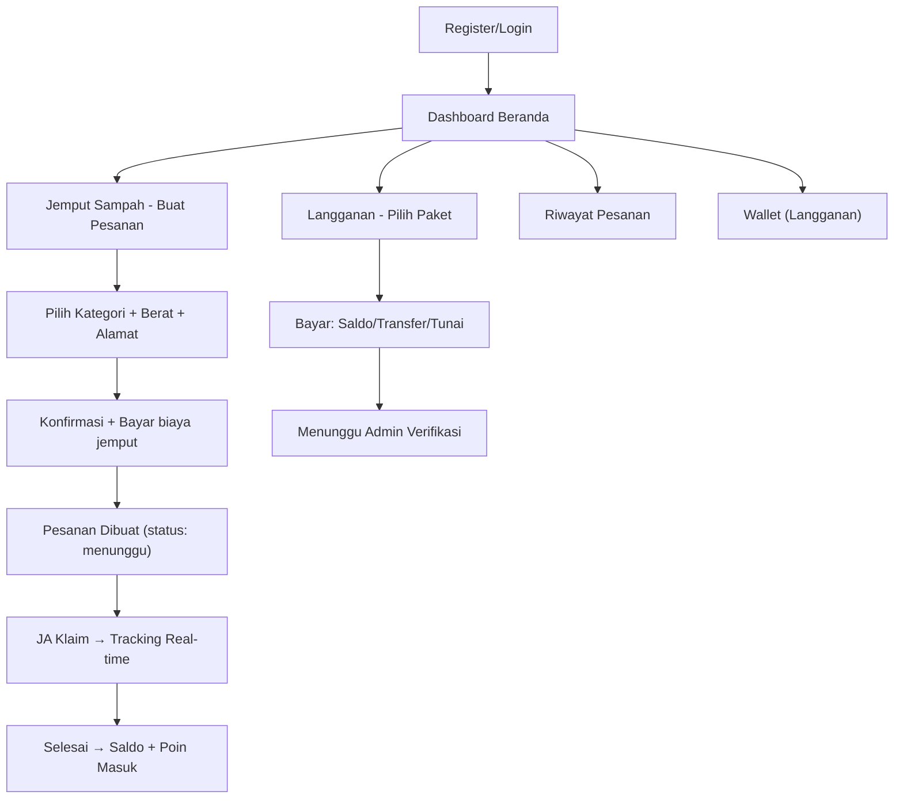
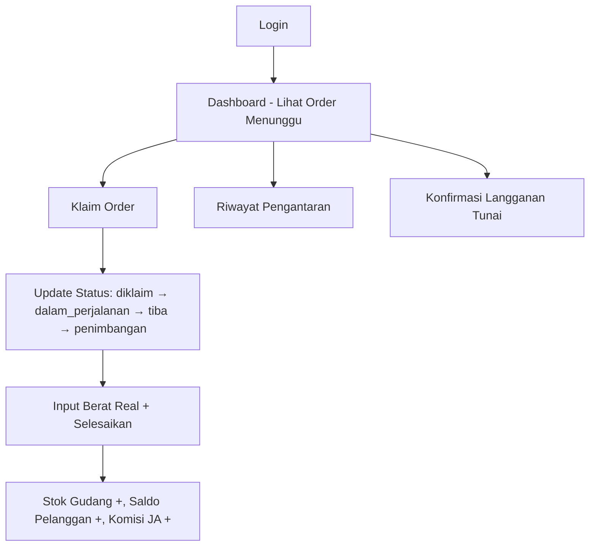
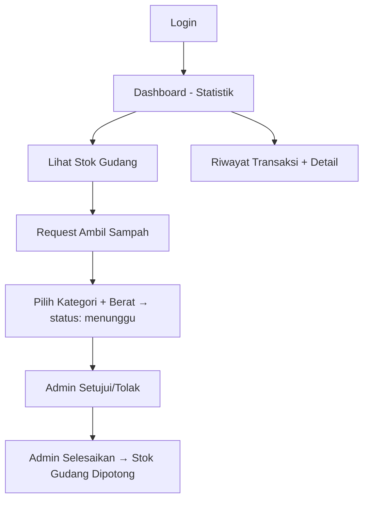
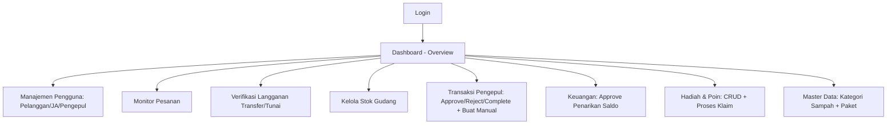
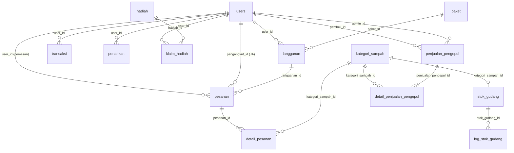

# 🔍 Audit Menyeluruh — GoGarbage Application

---

## 1. ANALISIS ALUR APLIKASI

### 🟢 Pelanggan (role: `pengguna`)

**Alur Detail:**
1. **Registrasi** → `users` (role: pengguna)
2. **Buat Pesanan** → `pesanan` + `detail_pesanan` + `transaksi` (biaya jemput)
3. **Tracking** → Polling status via `/api/pesanan/{id}/status`
4. **Selesai** → `users.saldo` + `users.poin` bertambah, `stok_gudang` bertambah
5. **Langganan** → `langganan` + `transaksi` (pembayaran)

### 🔵 Juru Angkut (role: `juru_angkut`)

**Alur Detail:**
1. **Dashboard** → Lihat order `status: menunggu`
2. **Klaim** → `pesanan.pengangkut_id = Auth::id()`, status → `diklaim`
3. **Proses** → Update step-by-step: `dalam_perjalanan` → `tiba` → `penimbangan`
4. **Selesaikan** → DB::transaction: update berat, hitung pendapatan, komisi, stok gudang
5. **Langganan Tunai** → Konfirmasi pembayaran tunai dari pelanggan

### 🟡 Pengepul (role: `pengepul`)

**Alur Detail:**
1. **Stok** → Lihat `stok_gudang` per `kategori_sampah`
2. **Request** → Create `penjualan_pengepul` (status: menunggu) + `detail_penjualan_pengepul`
3. **Lifecycle** → menunggu → disetujui → selesai (atau ditolak)

### 🔴 Admin Gudang (role: `admin_gudang`)

### 🔗 Koneksi Antar Aktor

| Dari | Ke | Trigger | Tabel Terdampak |
|------|----|---------|-----------------|
| Pelanggan | Juru Angkut | Buat pesanan | `pesanan`, `detail_pesanan` |
| Juru Angkut | Admin | Selesaikan order | `stok_gudang` (+), `users` (saldo/poin) |
| Juru Angkut | Admin | Konfirmasi tunai | `langganan` (status update) |
| Pengepul | Admin | Request ambil | `penjualan_pengepul` |
| Admin | Pengepul | Approve/Complete | `penjualan_pengepul`, `stok_gudang` (-) |
| Pelanggan | Admin | Penarikan saldo | `penarikan` |
| Pelanggan | Admin | Klaim hadiah | `klaim_hadiah` |

---

## 2. AUDIT DATABASE (Model & Migration)

### 📋 Daftar Seluruh Tabel

| # | Tabel | Kolom Utama | Model | Aktor |
|---|-------|-------------|-------|-------|
| 1 | `users` | id, name, email, password, role, telepon, alamat, saldo, poin, foto | User | Semua |
| 2 | `paket` | id, nama, deskripsi, harga, durasi_hari, frekuensi_jemput, satuan_frekuensi, info_tong, biaya_jemput, persentase_bagi_hasil, aktif | Paket | Pelanggan, Admin |
| 3 | `langganan` | id, user_id, paket_id, status, metode_pembayaran, bukti_pembayaran, jumlah_bayar, tanggal_mulai/selesai, disetujui_pada/oleh, catatan | Langganan | Pelanggan, JA, Admin |
| 4 | `kategori_sampah` | id, nama, slug, deskripsi, harga_per_kg, satuan, ikon, aktif | KategoriSampah | Semua |
| 5 | `pesanan` | id, nomor_pesanan, user_id, pengangkut_id, langganan_id, alamat_jemput, lat/lng, tanggal/jam_jemput, status, tipe_pesanan, biaya_jemput, total_berat, total_pendapatan, poin_didapat, komisi_pengangkut, bagian_perusahaan, catatan, diklaim_pada, diselesaikan_pada | Pesanan | Pelanggan, JA, Admin |
| 6 | `detail_pesanan` | id, pesanan_id, kategori_sampah_id, berat, harga_per_kg, subtotal | DetailPesanan | Pelanggan, JA |
| 7 | `transaksi` | id, nomor_transaksi, user_id, tipe, jumlah, saldo_sebelum/sesudah, status, referensi (morph), deskripsi | Transaksi | Pelanggan, Admin |
| 8 | `penarikan` | id, user_id, jumlah, metode, nama_rekening, nomor_rekening, nama_bank, status, disetujui_oleh/pada, alasan_penolakan, catatan | Penarikan | Pelanggan, Admin |
| 9 | `stok_gudang` | id, kategori_sampah_id, stok_kg, total_masuk, total_keluar | StokGudang | JA (write), Pengepul (read), Admin |
| 10 | `log_stok_gudang` | id, stok_gudang_id, kategori_sampah_id, tipe, jumlah_kg, stok_sebelum/sesudah, sumber (morph), deskripsi, dibuat_oleh | LogStokGudang | Admin |
| 11 | `penjualan_pengepul` | id, nomor_invoice, pembeli_id, admin_id, total_berat, total_harga, status_pembayaran, metode_pembayaran, status, catatan | PenjualanPengepul | Pengepul, Admin |
| 12 | `detail_penjualan_pengepul` | id, penjualan_pengepul_id, kategori_sampah_id, berat, harga_per_kg, subtotal | DetailPenjualanPengepul | Pengepul, Admin |
| 13 | `hadiah` | id, nama, deskripsi, biaya_poin, stok, gambar, tipe, aktif | Hadiah | Admin |
| 14 | `klaim_hadiah` | id, user_id, hadiah_id, poin_digunakan, status, diproses_oleh/pada, catatan | KlaimHadiah | Pelanggan, Admin |
| 15 | `sessions` | id, user_id, ip_address, user_agent, payload, last_activity | — | Framework |
| 16 | `password_reset_tokens` | email, token, created_at | — | Framework |
| 17 | `cache` / `cache_locks` | — | — | Framework |
| 18 | `jobs` / `job_batches` / `failed_jobs` | — | — | Framework |

### 🔗 Relasi Antar Tabel

### ⚠️ Temuan Database

| # | Masalah | Tingkat | Detail |
|---|---------|---------|--------|
| 1 | `penjualan_pengepul.admin_id` NOT NULLABLE | 🔴 Kritis | Migration awal mewajibkan `admin_id`, tapi pengepul bisa request tanpa admin → seharusnya `nullable()` |
| 2 | `log_stok_gudang` tidak selalu ditulis | 🟡 Sedang | Beberapa operasi stok (selesaikan order JA, complete pengepul) hanya update `stok_gudang` tanpa menulis log |
| 3 | `stok_gudang.total_masuk/total_keluar` tidak diupdate | 🟡 Sedang | Hanya `stok_kg` yang di-increment/decrement, tapi `total_masuk`/`total_keluar` tidak di-update |
| 4 | Tidak ada tabel `notifikasi` | 🟢 Rendah | Tidak ada sistem notifikasi untuk user (misal: "pesanan anda sudah diklaim") |

---

## 3. AUDIT CONTROLLER & LOGIKA BISNIS

### Pelanggan Controllers

| Controller | Method | Status | Catatan |
|-----------|--------|--------|---------|
| `BerandaController` | `index` | ✅ OK | Dashboard dengan 4 aktivitas terakhir |
| `JemputSampahController` | `index`, `store`, `konfirmasi_pesanan`, `confirm_pesanan`, `order_sukses`, `tracking_pesanan`, `order_selesai` | ✅ OK | Alur lengkap pesanan jemput |
| `LanggananController` | `index`, `store`, `batalkan` | ✅ OK | Support saldo/transfer/tunai |
| `RiwayatController` | `index` | ✅ OK | Riwayat dengan filter |
| — | **Penarikan saldo** | ❌ Missing | Tidak ada controller untuk pelanggan menarik saldo |
| — | **Klaim hadiah** | ❌ Missing | Tidak ada controller untuk pelanggan mengklaim hadiah |
| — | **Profil** | ❌ Missing | Tidak ada controller untuk edit profil (foto, alamat, telepon) |

### Juru Angkut Controllers

| Controller | Method | Status | Catatan |
|-----------|--------|--------|---------|
| `DashboardController` | `index` | ✅ OK | Stats + order menunggu + riwayat |
| `OrderController` | `index`, `show`, `terima`, `tolak`, `prosesJemput`, `updateStatus`, `selesaikanOrder`, `orderSelesai`, `pembayaranBerhasil`, `langgananTunai`, `konfirmasiTunai` | ✅ OK | Alur sangat lengkap |
| `RiwayatController` | `index` | ✅ OK | Riwayat pengantaran |
| — | **Profil** | ❌ Missing | Tidak ada edit profil untuk JA |
| — | **Statistik/Earning** | ❌ Missing | Tidak ada halaman detail pendapatan JA |

### Pengepul Controllers

| Controller | Method | Status | Catatan |
|-----------|--------|--------|---------|
| `DashboardController` | `index` | ✅ OK | Stats + request aktif + transaksi terakhir |
| `StokController` | `index` | ✅ OK | Lihat stok gudang |
| `RequestController` | `index`, `store` | ✅ OK | Request ambil sampah dengan DB transaction |
| `RiwayatController` | `index`, `show` | ✅ OK | Riwayat + detail |
| — | **Profil** | ❌ Missing | Tidak ada edit profil |

### Admin Controllers

| Controller | Method | Status | Catatan |
|-----------|--------|--------|---------|
| `DashboardController` | `index` | ✅ OK | Stats + charts + recent orders |
| `PenggunaController` | `pelanggan`, `juruAngkut`, `storeJA`, `updateJA`, `destroyJA`, `pengepul`, `storePengepul`, `updatePengepul`, `destroyPengepul` | ✅ OK | CRUD lengkap JA + Pengepul |
| `PesananController` | `index`, `batalkan`, `verifikasi` | ✅ OK | Monitor + aksi pesanan |
| `LanggananController` | `index`, `setujui`, `tolak`, `paketIndex`, `storePaket`, `updatePaket`, `destroyPaket` | ✅ OK | Verifikasi + CRUD paket |
| `StokController` | `index`, `adjust` | ✅ OK | Lihat + adjust manual stok |
| `TransaksiPengepulController` | `index`, `store`, `approve`, `reject`, `complete` | ✅ OK | Full lifecycle + manual create |
| `KeuanganController` | `index`, `approve`, `reject` | ✅ OK | Penarikan saldo |
| `HadiahController` | `index`, `store`, `update`, `destroy`, `prosesKlaim` | ✅ OK | CRUD + klaim |
| `KategoriSampahController` | `index`, `store`, `update`, `destroy` | ✅ OK | CRUD kategori |

### ⚠️ Temuan Logika Bisnis

| # | Masalah | Tingkat | Detail |
|---|---------|---------|--------|
| 1 | `selesaikanOrder` (JA) tidak menulis `log_stok_gudang` | 🟡 | Stok bertambah tapi tidak ada audit trail |
| 2 | `complete` (Admin pengepul) tidak menulis `log_stok_gudang` | 🟡 | Stok berkurang tapi tidak ada audit trail |
| 3 | `store` (Admin manual) tidak menulis `log_stok_gudang` | 🟡 | Sama, konsistensi log |
| 4 | Pelanggan tidak bisa menarik saldo | 🔴 | Route & controller tidak ada, tapi tabel `penarikan` sudah ada |
| 5 | Pelanggan tidak bisa klaim hadiah | 🔴 | Route & controller tidak ada, tapi tabel `klaim_hadiah` sudah ada |
| 6 | `RiwayatController` (Pelanggan) akses `$p->pengangkut->no_hp` | 🟡 | Kolom `no_hp` tidak ada di `users`, seharusnya `telepon` |
| 7 | API endpoint `/api/pesanan/{id}/status` tanpa auth middleware | 🟡 | Siapapun bisa polling status pesanan |

---

## 4. AUDIT TAMPILAN & NAVIGASI

### Pelanggan — Bottom Navbar (5 item)

| # | Menu | Route | Status |
|---|------|-------|--------|
| 1 | Home | `pelanggan.index` | ✅ Ada |
| 2 | Order | `pelanggan.jemput-sampah` | ✅ Ada |
| 3 | History | `pelanggan.riwayat` | ✅ Ada |
| 4 | Wallet | `pelanggan.langganan` | ✅ Ada |
| 5 | Profile | `href=""` (kosong!) | ⚠️ **Link kosong, tidak mengarah ke mana pun** |

**Yang belum ada:**
| # | Menu | Keterangan | Prioritas |
|---|------|-----------|-----------|
| 1 | **Tarik Saldo** | Pelanggan punya saldo tapi tidak bisa menariknya | 🔴 Tinggi |
| 2 | **Hadiah** | Pelanggan punya poin tapi tidak bisa klaim hadiah | 🔴 Tinggi |
| 3 | **Profile** | Navbar ada tapi link kosong, tidak ada halaman | 🟡 Sedang |

### Juru Angkut — Bottom Navbar (4 item)

| # | Menu | Route | Status |
|---|------|-------|--------|
| 1 | Home | `juru-angkut.index` | ✅ Ada |
| 2 | Order | `juru-angkut.order.index` | ✅ Ada |
| 3 | History | `juru-angkut.riwayat` | ✅ Ada |
| 4 | Profile | `href="#"` (placeholder!) | ⚠️ **Link placeholder** |

**Yang belum ada:**
| # | Menu | Keterangan | Prioritas |
|---|------|-----------|-----------|
| 1 | **Profile** | Link ada tapi mengarah ke `#` | 🟡 Sedang |
| 2 | **Langganan Tunai** | Menu terpisah, tapi hanya bisa diakses dari dashboard | 🟢 Rendah |

### Pengepul — Bottom Navbar (4 item)

| # | Menu | Route | Status |
|---|------|-------|--------|
| 1 | Home | `pengepul.index` | ✅ Ada |
| 2 | Stok | `pengepul.stok` | ✅ Ada |
| 3 | Request | `pengepul.request` | ✅ Ada |
| 4 | Riwayat | `pengepul.riwayat` | ✅ Ada |

**Yang belum ada:**
| # | Menu | Keterangan | Prioritas |
|---|------|-----------|-----------|
| 1 | **Profile** | Tidak ada di navbar | 🟡 Sedang |

### Admin — Sidebar (sudah lengkap)

| # | Menu | Status |
|---|------|--------|
| 1 | Dashboard | ✅ |
| 2 | Manajemen Pengguna (Pelanggan/JA/Pengepul) | ✅ |
| 3 | Pesanan | ✅ |
| 4 | Langganan | ✅ |
| 5 | Stok Sampah | ✅ |
| 6 | Transaksi Pengepul | ✅ |
| 7 | Keuangan | ✅ |
| 8 | Hadiah & Poin | ✅ |
| 9 | Master Data (Kategori + Paket) | ✅ |

---

## 5. RINGKASAN — DAFTAR YANG PERLU DITINDAKLANJUTI

### ✅ Daftar Menu yang Belum Dibuat

| No | Nama Menu | Aktor | Prioritas | Keterangan |
|----|-----------|-------|-----------|------------|
| 1 | Tarik Saldo | Pelanggan | 🔴 Tinggi | Tabel `penarikan` ada, admin sudah bisa approve, tapi pelanggan tidak punya UI untuk request |
| 2 | Hadiah / Tukar Poin | Pelanggan | 🔴 Tinggi | Tabel `hadiah` + `klaim_hadiah` ada, admin sudah CRUD, tapi pelanggan tidak bisa lihat/klaim |
| 3 | Profile | Pelanggan | 🟡 Sedang | Navbar icon ada tapi `href=""` kosong |
| 4 | Profile | Juru Angkut | 🟡 Sedang | Navbar icon ada tapi `href="#"` placeholder |
| 5 | Profile | Pengepul | 🟡 Sedang | Tidak ada di navbar sama sekali |

### ✅ Daftar Fungsi yang Belum Dibuat

| No | Nama Fungsi | Controller | Aktor | Keterangan |
|----|-------------|------------|-------|------------|
| 1 | `index` (list penarikan) | `PenarikanController` | Pelanggan | Lihat daftar penarikan + saldo tersedia |
| 2 | `store` (request penarikan) | `PenarikanController` | Pelanggan | Submit request penarikan ke bank/ewallet |
| 3 | `index` (list hadiah) | `HadiahController` | Pelanggan | Lihat katalog hadiah + poin user |
| 4 | `klaim` (tukar poin) | `HadiahController` | Pelanggan | Submit klaim hadiah menggunakan poin |
| 5 | `index` (profil) | `ProfileController` | Pelanggan | Edit nama, telepon, alamat, foto |
| 6 | `index` (profil) | `ProfileController` | Juru Angkut | Edit profil JA |
| 7 | `index` (profil) | `ProfileController` | Pengepul | Edit profil pengepul |
| 8 | `writeLog` (log stok) | Helper / Service | System | Fungsi reusable untuk menulis `log_stok_gudang` |

### ✅ Daftar yang Perlu Diperbaiki

| No | Bagian | Masalah | Solusi yang Disarankan |
|----|--------|---------|------------------------|
| 1 | Migration `penjualan_pengepul` | `admin_id` NOT NULLABLE — gagal saat pengepul request tanpa admin | Buat migration baru: `$table->foreignId('admin_id')->nullable()->change()` |
| 2 | `Pelanggan\RiwayatController` L69 | Akses `$p->pengangkut->no_hp` — kolom `no_hp` tidak ada | Ganti ke `$p->pengangkut->telepon` |
| 3 | `OrderController@selesaikanOrder` | Tidak menulis `log_stok_gudang` saat stok masuk | Tambahkan `LogStokGudang::create(...)` setelah `stok_gudang` diupdate |
| 4 | `TransaksiPengepulController@complete` | Tidak menulis `log_stok_gudang` saat stok keluar | Tambahkan `LogStokGudang::create(...)` setelah decrement |
| 5 | `TransaksiPengepulController@store` | Tidak menulis `log_stok_gudang` saat admin buat manual | Sama seperti di atas |
| 6 | `stok_gudang.total_masuk/total_keluar` | Field tidak pernah diupdate — selalu 0 | Update bersamaan saat increment/decrement `stok_kg` |
| 7 | API `/api/pesanan/{id}/status` | Tanpa auth middleware — bisa diakses publik | Bungkus dengan `Route::middleware('auth')` |
| 8 | Pelanggan navbar "Profile" | `href=""` — link kosong | Arahkan ke `/profile` atau buat halaman profil khusus pelanggan |
| 9 | JA navbar "Profile" | `href="#"` — placeholder | Arahkan ke halaman profil JA |

---

> [!IMPORTANT]
> **Prioritas tertinggi:** Buat halaman **Tarik Saldo** dan **Hadiah/Tukar Poin** untuk pelanggan. Kedua fitur ini sudah memiliki backend (tabel + admin panel) tetapi pelanggan sama sekali tidak bisa mengaksesnya dari aplikasi mereka.

> [!WARNING]
> **Bug aktif:** `penjualan_pengepul.admin_id` NOT NULLABLE menyebabkan error saat pengepul membuat request (karena saat request dibuat, belum ada admin yang assign). Ini perlu migration fix segera.

> [!NOTE]
> **Asumsi:** Audit ini berdasarkan kode yang ada di workspace. Tidak ada testing runtime yang dilakukan. Beberapa fitur mungkin sudah berfungsi meskipun ada concern di atas jika ada workaround di level aplikasi (misalnya default value di database).
