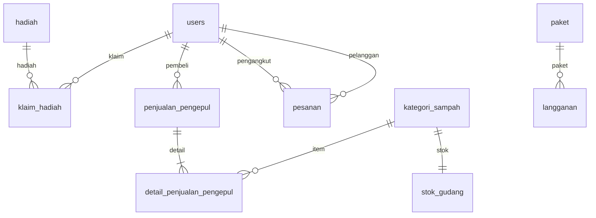

# Spesifikasi Form Input — Admin Panel GoGarbage

Dokumen ini merangkum field input per halaman admin sesuai rencana CRUD dan struktur migration. Gunakan sebagai acuan saat mengintegrasikan controller dan form di Blade.

**Catatan UI vs database:** Kolom "Tipe" dan "Poin/kg" di halaman Kategori Sampah (view saat ini) **tidak ada** di tabel `kategori_sampah`. Gunakan kolom DB: `nama`, `harga_per_kg`, `satuan`, `stok_gudang.stok_kg`, `aktif`.

---

## Ringkasan model Eloquent

| Model | Tabel | Kegunaan admin |
|-------|-------|----------------|
| `User` | `users` | Pelanggan, juru angkut, pengepul |
| `KategoriSampah` | `kategori_sampah` | Master data kategori |
| `Paket` | `paket` | Master data paket langganan |
| `Hadiah` | `hadiah` | Katalog hadiah |
| `KlaimHadiah` | `klaim_hadiah` | Proses klaim (bukan form tambah admin) |
| `PenjualanPengepul` | `penjualan_pengepul` | Transaksi ke pengepul |
| `DetailPenjualanPengepul` | `detail_penjualan_pengepul` | Baris item penjualan |
| `StokGudang` | `stok_gudang` | Stok per kategori (read + mutasi otomatis) |
| `LogStokGudang` | `log_stok_gudang` | Log mutasi (read) |
| `Pesanan` | `pesanan` | Monitoring pesanan |
| `Langganan` | `langganan` | Verifikasi langganan |
| `Penarikan` | `penarikan` | Approve penarikan saldo |
| `Transaksi` | `transaksi` | Riwayat keuangan (read) |

---

## 1. Master Data — Kategori Sampah

**View:** `resources/views/admin/master_data/kategori_sampah.blade.php`  
**Operasi:** INSERT/UPDATE `kategori_sampah`; saat create, buat juga `stok_gudang` dengan `stok_kg = 0`.

| Field (name) | Label UI | Type input | Validasi | Keterangan |
|--------------|----------|------------|----------|------------|
| `nama` | Nama Kategori | `text` | required, max 255 | |
| `slug` | Slug URL | `text` | unique, optional | Auto dari `nama` jika kosong |
| `deskripsi` | Deskripsi | `textarea` | optional | |
| `harga_per_kg` | Harga per kg | `number` step 0.01 | required, min 0 | |
| `satuan` | Satuan | `text` atau `select` | optional | Default: `kg` |
| `ikon` | Ikon | `file` (image) | optional, max ~2MB | Simpan path ke kolom `ikon` |
| `aktif` | Status aktif | `checkbox` | boolean | Default: true; nonaktifkan = soft delete |

**Delete:** set `aktif = false` (disarankan, ada FK dari pesanan/detail).

---

## 2. Master Data — Paket Langganan

**View:** `resources/views/admin/master_data/paket.blade.php`  
**Operasi:** INSERT/UPDATE `paket`

| Field (name) | Label UI | Type input | Validasi | Keterangan |
|--------------|----------|------------|----------|------------|
| `nama` | Nama Paket | `text` | required | |
| `deskripsi` | Deskripsi | `textarea` | optional | |
| `harga` | Harga Paket (Rp) | `number` | required, min 0 | |
| `durasi_hari` | Durasi (hari) | `number` integer | required, min 1 | |
| `frekuensi_jemput` | Frekuensi jemput | `number` integer | required, min 1 | |
| `satuan_frekuensi` | Satuan frekuensi | `select` | required | `minggu`, `bulan` |
| `info_tong` | Info tong / fasilitas | `text` | optional | |
| `biaya_jemput` | Biaya jemput (Rp) | `number` | optional, min 0 | Default 0 |
| `persentase_bagi_hasil` | Bagi hasil pelanggan (%) | `number` step 0.01 | 0–100 | Default 100 |
| `aktif` | Status aktif | `checkbox` | boolean | Default true |

---

## 3. Hadiah & Poin — Tambah/Edit Hadiah

**View:** `resources/views/admin/hadiah/index.blade.php` (bagian Katalog)  
**Operasi:** INSERT/UPDATE `hadiah`

| Field (name) | Label UI | Type input | Validasi | Keterangan |
|--------------|----------|------------|----------|------------|
| `nama` | Nama Hadiah | `text` | required | |
| `deskripsi` | Deskripsi | `textarea` | optional | |
| `biaya_poin` | Biaya Poin | `number` integer | required, min 1 | |
| `stok` | Stok | `number` integer | required, min 0 | |
| `gambar` | Gambar | `file` (image) | optional | Path ke `gambar` |
| `tipe` | Tipe hadiah | `select` | required | `voucher`, `fisik`, `lainnya` |
| `aktif` | Status aktif | `checkbox` | boolean | Default true |

### Proses Klaim (bukan form tambah)

**Tabel:** `klaim_hadiah` — dibuat oleh pelanggan.

| Field (name) | Label UI | Type input | Validasi | Side effect |
|--------------|----------|------------|----------|-------------|
| `status` | Status | `select` / radio | `disetujui`, `dikirim`, `ditolak` | Lihat bawah |
| `catatan` | Catatan | `textarea` | wajib jika `ditolak` | |
| `diproses_oleh` | — | hidden | `auth()->id()` | Auto |
| `diproses_pada` | — | — | `now()` | Auto |

**Side effect bisnis:**
- `disetujui` → kurangi `hadiah.stok`
- `ditolak` → kembalikan `users.poin` sebesar `poin_digunakan`
- `dikirim` → update status saja (setelah disetujui)

---

## 4. Transaksi Pengepul — Buat Penjualan

**View:** `resources/views/admin/transaksi_pengepul/index.blade.php`  
**Operasi:** INSERT `penjualan_pengepul` + `detail_penjualan_pengepul`; UPDATE `stok_gudang`; INSERT `log_stok_gudang` (tipe `keluar`).

### Header form

| Field (name) | Label UI | Type input | Validasi | Keterangan |
|--------------|----------|------------|----------|------------|
| `pembeli_id` | Pengepul | `select` | required, exists users role `pengepul` | FK `pembeli_id` |
| `nomor_invoice` | No. Invoice | `text` | unique | Auto: `PenjualanPengepul::generateNomorInvoice()` |
| `metode_pembayaran` | Metode bayar | `select` | required | `tunai`, `transfer` |
| `status_pembayaran` | Status bayar | `select` | required | `belum_bayar`, `lunas` |
| `catatan` | Catatan | `textarea` | optional | |
| `admin_id` | — | hidden | — | User admin login |

### Baris item (repeater, min. 1 baris)

| Field (name) | Label UI | Type input | Validasi | Keterangan |
|--------------|----------|------------|----------|------------|
| `items[].kategori_sampah_id` | Jenis sampah | `select` | required | Tampilkan stok tersedia |
| `items[].berat` | Berat (kg) | `number` step 0.01 | required, ≤ stok | |
| `items[].harga_per_kg` | Harga/kg ke pengepul | `number` | required | Prefill dari `kategori_sampah.harga_per_kg` |
| `items[].subtotal` | Subtotal | `number` readonly | — | `berat × harga_per_kg` |

### Field derived (readonly)

| Field | Sumber |
|-------|--------|
| `total_berat` | SUM `items[].berat` |
| `total_harga` | SUM `items[].subtotal` |

### Edit terbatas (setelah simpan)

| Field | Type | Keterangan |
|-------|------|------------|
| `status_pembayaran` | `select` | Hanya ubah ke `lunas` |
| `catatan` | `textarea` | optional |

Jangan edit detail berat setelah stok terpotong.

---

## 5. Manajemen Pengguna — Tambah Juru Angkut

**View:** `resources/views/admin/pengguna/juru_angkut.blade.php`  
**Operasi:** INSERT `users` dengan `role = juru_angkut`

| Field (name) | Label UI | Type input | Validasi | Keterangan |
|--------------|----------|------------|----------|------------|
| `name` | Nama lengkap | `text` | required | |
| `email` | Email | `email` | required, unique | |
| `password` | Password | `password` | required (create), min 8 | |
| `password_confirmation` | Konfirmasi password | `password` | same:password | |
| `telepon` | No. Telepon | `tel` / `text` | optional, max 20 | |
| `alamat` | Alamat | `textarea` | optional | |
| `foto` | Foto profil | `file` (image) | optional | |
| `role` | — | `hidden` | fixed | `juru_angkut` |

**Jangan di form create:** `saldo`, `poin` (default 0 di DB).

### Edit juru angkut

| Field | Type | Keterangan |
|-------|------|------------|
| `name`, `email`, `telepon`, `alamat`, `foto` | sama seperti create | Email unique kecuali record sendiri |
| `password` | `password` | optional; kosong = tidak diubah |
| `saldo`, `poin` | readonly | Tampil di detail, jangan edit manual |

---

## 6. Manajemen Pengguna — Tambah Pengepul

**View:** `resources/views/admin/pengguna/pengepul.blade.php`  
**Form:** Identik dengan Juru Angkut, kecuali `role = pengepul`.

**Tampilan list (read-only, bukan input form):**

| Elemen | Sumber query |
|--------|----------------|
| Total Transaksi | COUNT `penjualan_pengepul` WHERE `pembeli_id` |
| Total Berat | SUM `penjualan_pengepul.total_berat` |

---

## 7. Halaman tanpa tombol "Tambah" (aksi approval / read)

### Pelanggan (read-only list)

**View:** `admin/pengguna/pelanggan.blade.php`  
Tidak ada form tambah — pelanggan mendaftar sendiri.

| Kolom tampil | DB |
|--------------|-----|
| Nama, Email, Telepon, Saldo, Poin | `users` WHERE `role = pengguna` |

---

### Pesanan — Monitoring

**View:** `admin/pesanan/index.blade.php`

| Aksi | Input | Type |
|------|-------|------|
| Batalkan pesanan | — | POST aksi |
| Verifikasi bukti (jika ada) | `status` / catatan | `select`, `textarea` |

---

### Langganan — Setujui / Tolak

**View:** `admin/langganan/index.blade.php`

| Aksi | Input | Type | Auto-set |
|------|-------|------|----------|
| Setujui | — | POST | `status=aktif`, `tanggal_mulai`, `tanggal_selesai`, `disetujui_pada`, `disetujui_oleh` |
| Tolak | `catatan` | `textarea` | `status=dibatalkan` |

Hanya untuk `status` ∈ `menunggu`, `menunggu_tunai`.

---

### Keuangan — Penarikan saldo

**View:** `admin/keuangan/index.blade.php`

| Aksi | Input | Type | Keterangan |
|------|-------|------|------------|
| Setujui | — | POST | Kurangi `users.saldo`, buat `transaksi` |
| Tolak | `alasan_penolakan` | `textarea` | required |

---

### Stok Sampah (read + adjustment opsional)

**View:** `admin/stok/index.blade.php`

| Adjustment manual (opsional) | Type |
|------------------------------|------|
| `kategori_sampah_id` | `select` |
| `jumlah_kg` | `number` |
| `tipe` | `select`: `masuk` / `keluar` |
| `deskripsi` | `textarea` |

---

### Dashboard (read-only)

**View:** `admin/dashboard/index.blade.php`  
Tidak ada form input — statistik dari agregat `users`, `pesanan`, `stok_gudang`, dll.

---

## Diagram relasi model (ringkas)

---

## Langkah integrasi berikutnya (di luar scope dokumen ini)

1. Controller + route per modul CRUD  
2. Validasi `FormRequest` per form  
3. Hubungkan Blade (modal/form) ke endpoint di atas  
4. Jalankan `php artisan storage:link` untuk upload `ikon`, `gambar`, `foto`
