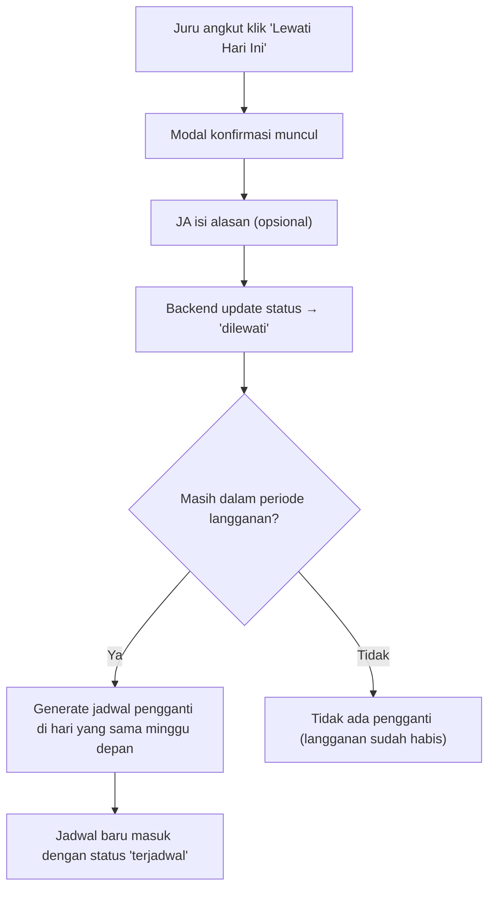

# Implementasi Fitur Jadwal Juru Angkut

## Latar Belakang

Saat ini, sistem GoGarbage **belum memiliki mekanisme jadwal otomatis** untuk pelanggan berlangganan. Semua penjemputan — baik reguler maupun langganan — dilakukan melalui alur manual: pelanggan buat pesanan → juru angkut klaim dari daftar "Order Masuk". Tidak ada tabel database yang mengelola jadwal rutin.

### Temuan Analisa Database Saat Ini

| Tabel/Model | Field Relevan | Status |
|---|---|---|
| [Paket](file:///d:/Makul/JOKI/gogarbage/app/Models/Paket.php) | `frekuensi_jemput` (int), `satuan_frekuensi` (minggu/bulan), `durasi_hari` | ✅ Sudah ada — menyimpan aturan frekuensi (misal: 2x/minggu) |
| [Langganan](file:///d:/Makul/JOKI/gogarbage/app/Models/Langganan.php) | `user_id`, `paket_id`, `status`, `tanggal_mulai`, `tanggal_selesai` | ✅ Sudah ada — tapi **tidak menyimpan hari-hari jemput** |
| [Pesanan](file:///d:/Makul/JOKI/gogarbage/app/Models/Pesanan.php) | `tipe_pesanan` (reguler/langganan), `langganan_id`, `tanggal_jemput` | ✅ Sudah ada — pesanan satuan, bukan jadwal rutin |
| Jadwal Langganan | — | ❌ **Belum ada** — tidak ada tabel untuk menyimpan jadwal hari-hari jemput |

### Contoh Paket dari Seeder

| Paket | Frekuensi | Satuan | Artinya |
|---|---|---|---|
| Paket Hemat | 2 | minggu | Jemput **2x per minggu** (misal Senin & Kamis) |
| Paket Reguler | 3 | minggu | Jemput **3x per minggu** (misal Senin, Rabu, Jumat) |
| Paket Premium | 7 | minggu | Jemput **setiap hari** |
| Paket Tahunan | 3 | minggu | Jemput **3x per minggu** selama 365 hari |

---

## 1. Isi & Aksi Menu Jadwal (Juru Angkut)

### Tampilan Menu Jadwal

Halaman jadwal juru angkut menampilkan **daftar penjemputan langganan yang dijadwalkan hari ini dan ke depan**, dikelompokkan per hari.

#### Komponen yang Ditampilkan:
- **Tab/Filter Tanggal**: Hari ini, Besok, Minggu ini (calendar strip horizontal)
- **Card Jadwal per Pelanggan**, berisi:
  - Nama pelanggan & foto
  - Nama paket langganan (Hemat/Reguler/Premium)
  - Alamat jemput + link Maps
  - Jam jemput yang dijadwalkan
  - Status jadwal: `terjadwal` / `selesai` / `dilewati`
  - Badge: "Berlangganan" + sisa hari langganan
- **Summary Card**: Total jadwal hari ini, yang sudah selesai, yang dilewati
- **Tombol "Mulai Jemput"**: Langsung buat pesanan dari jadwal dan masuk proses jemput

#### Aksi yang Bisa Dilakukan Juru Angkut:
| Aksi | Deskripsi |
|---|---|
| **Mulai Jemput** | Konversi jadwal → pesanan baru (tipe `langganan`), langsung ke halaman proses jemput |
| **Lewati Hari Ini** | Tandai jadwal hari ini sebagai `dilewati`, otomatis reschedule ke minggu depan |
| **Lihat Rute** | Buka Google Maps dengan semua alamat jadwal hari ini sebagai waypoints |
| **Filter** | Filter berdasarkan tanggal, status, atau nama pelanggan |

---

## 2. Logika Paket Langganan → Penentuan Jadwal

### Mekanisme Penentuan Hari Jemput

Saat admin **menyetujui langganan**, sistem otomatis men-generate jadwal berdasarkan `frekuensi_jemput` dan `satuan_frekuensi` dari paket.

#### Aturan Distribusi Hari:

| Frekuensi/Minggu | Hari yang Digenerate | Pola |
|---|---|---|
| 1x | Senin | 1 hari tetap |
| 2x | Senin, Kamis | Merata (jarak 3 hari) |
| 3x | Senin, Rabu, Jumat | Merata (selang sehari) |
| 4x | Senin, Selasa, Kamis, Jumat | Skip Rabu & weekend |
| 5x | Senin–Jumat | Hari kerja |
| 6x | Senin–Sabtu | Kecuali Minggu |
| 7x | Senin–Minggu | Setiap hari |

#### Proses Generate Jadwal:

```
Langganan disetujui (tanggal_mulai → tanggal_selesai)
    ↓
Ambil frekuensi dari Paket (misal: 2x/minggu)
    ↓
Map ke hari: [Senin, Kamis]
    ↓
Loop dari tanggal_mulai sampai tanggal_selesai
    ↓
Untuk setiap hari yang cocok → INSERT ke tabel `jadwal_langganan`
```

> [!IMPORTANT]
> Jadwal digenerate **satu kali** saat langganan disetujui, bukan dihitung on-the-fly. Ini memungkinkan juru angkut melihat jadwal ke depan dan memungkinkan fitur skip/reschedule.

### Struktur Tabel Baru: `jadwal_langganan`

```php
Schema::create('jadwal_langganan', function (Blueprint $table) {
    $table->id();
    $table->foreignId('langganan_id')->constrained('langganan')->onDelete('cascade');
    $table->foreignId('user_id')->constrained('users')->onDelete('cascade');        // pelanggan
    $table->foreignId('pengangkut_id')->nullable()->constrained('users')->onDelete('set null'); // juru angkut yang ditugaskan
    $table->foreignId('pesanan_id')->nullable()->constrained('pesanan')->onDelete('set null');  // link ke pesanan jika sudah dieksekusi
    $table->date('tanggal_jemput');
    $table->time('jam_jemput')->default('08:00');
    $table->enum('status', ['terjadwal', 'selesai', 'dilewati'])->default('terjadwal');
    $table->text('catatan_skip')->nullable();       // alasan jika dilewati
    $table->timestamp('dilewati_pada')->nullable();
    $table->timestamp('diselesaikan_pada')->nullable();
    $table->timestamps();

    $table->index(['tanggal_jemput', 'status']);
    $table->index(['pengangkut_id', 'tanggal_jemput']);
    $table->index(['user_id', 'tanggal_jemput']);
});
```

### Model Baru: `JadwalLangganan`

Relasi:
- `belongsTo` → `Langganan`, `User` (pelanggan), `User` (pengangkut), `Pesanan`
- Scope `hariIni()`, `mendatang()`, `terjadwal()`

---

## 3. Notifikasi Juru Angkut

### Strategi Notifikasi (Tanpa Push Notification Server)

Karena aplikasi ini adalah web-based (bukan mobile native), kita menggunakan **in-app notification** yang muncul saat juru angkut membuka dashboard.

#### Implementasi:

| Komponen | Mekanisme |
|---|---|
| **Banner Dashboard** | Di dashboard juru angkut, tampilkan banner hijau: "📋 Kamu punya **X jadwal** jemput hari ini" jika ada jadwal `terjadwal` untuk hari ini |
| **Badge di Nav** | Di bottom navigation, menu "Jadwal" diberi badge merah (jumlah jadwal hari ini yang belum dikerjakan) |
| **Floating Bar** | Seperti "Transaksi Berlangsung" di pelanggan — tampilkan bar floating "Jadwal berikutnya: [Nama] - [Jam]" |

#### Query untuk Notifikasi:
```php
$jadwalHariIni = JadwalLangganan::where('tanggal_jemput', today())
    ->where('status', 'terjadwal')
    ->where(function($q) use ($userId) {
        $q->where('pengangkut_id', $userId)
          ->orWhereNull('pengangkut_id'); // belum ada JA yang ditugaskan
    })
    ->count();
```

> [!NOTE]
> Untuk fase awal, semua jadwal bisa dikerjakan oleh **semua juru angkut** (model pool/shared). Ke depannya bisa ditambahkan assignment per-area jika dibutuhkan. Jika tidak, jadwal hanya dilihat oleh semua juru angkut dan siapa yang pertama "Mulai Jemput" akan otomatis ter-assign.

---

## 4. Fitur Skip / Reschedule

### Alur Skip:



### Logika Reschedule:

```php
public function skipJadwal(JadwalLangganan $jadwal, ?string $alasan = null)
{
    // 1. Tandai jadwal saat ini sebagai dilewati
    $jadwal->update([
        'status' => 'dilewati',
        'catatan_skip' => $alasan,
        'dilewati_pada' => now(),
    ]);

    // 2. Hitung tanggal pengganti (hari yang sama, minggu depan)
    $tanggalPengganti = $jadwal->tanggal_jemput->addWeek();

    // 3. Cek apakah masih dalam periode langganan
    $langganan = $jadwal->langganan;
    if ($tanggalPengganti->lte($langganan->tanggal_selesai)) {
        // 4. Cek tidak ada jadwal duplicate di tanggal tersebut
        $exists = JadwalLangganan::where('langganan_id', $jadwal->langganan_id)
            ->where('tanggal_jemput', $tanggalPengganti)
            ->exists();

        if (!$exists) {
            JadwalLangganan::create([
                'langganan_id' => $jadwal->langganan_id,
                'user_id' => $jadwal->user_id,
                'tanggal_jemput' => $tanggalPengganti,
                'jam_jemput' => $jadwal->jam_jemput,
                'status' => 'terjadwal',
            ]);
        }
    }
}
```

### Aturan Skip:
- Jadwal yang sudah di-skip **tidak bisa di-undo** (tapi admin bisa menambah jadwal manual)
- Jadwal pengganti hanya dibuat jika tanggal masih dalam `tanggal_selesai` langganan
- Tidak ada batas jumlah skip (tapi tercatat dan visible di admin)

---

## 5. Tampilan Sisi Pelanggan (Dashboard Indikator)

### Indikator di Dashboard Pelanggan

Pada [index.blade.php pelanggan](file:///d:/Makul/JOKI/gogarbage/resources/views/pelanggan/index.blade.php), akan ditambahkan **card jadwal hari ini** tepat sebelum section "Aktivitas Terakhir":

#### Komponen:
```
┌─────────────────────────────────────┐
│ 🗓️ Jadwal Jemput Hari Ini          │
│                                      │
│ ♻️ Penjemputan sampah dijadwalkan    │
│    hari ini (Paket Hemat)            │
│                                      │
│ ⏰ Jam: 08:00 - 10:00               │
│ 📍 Status: Menunggu juru angkut     │
│                                      │
│ [Lihat Detail Jadwal]                │
└─────────────────────────────────────┘
```

#### Kondisi Tampil:
- Hanya muncul jika user **berlangganan aktif** DAN ada jadwal `terjadwal` hari ini
- Jika jadwal hari ini sudah `selesai`, tampilkan kartu hijau: "✅ Sampah hari ini sudah dijemput!"
- Jika jadwal hari ini `dilewati`, tampilkan kartu kuning: "⏭️ Jadwal hari ini dilewati, dijadwalkan ulang ke [tanggal]"
- Jika tidak ada jadwal hari ini, tidak tampilkan apa-apa

---

## Proposed Changes

### Database

#### [NEW] Migration: `create_jadwal_langganan_table`
Tabel baru untuk menyimpan jadwal penjemputan per-hari per-langganan.

---

### Models

#### [NEW] `app/Models/JadwalLangganan.php`
Model baru dengan relasi ke `Langganan`, `User`, `Pesanan`. Scopes: `hariIni()`, `mendatang()`, `terjadwal()`.

#### [MODIFY] [Langganan.php](file:///d:/Makul/JOKI/gogarbage/app/Models/Langganan.php)
Tambah relasi `hasMany` ke `JadwalLangganan`.

#### [MODIFY] [User.php](file:///d:/Makul/JOKI/gogarbage/app/Models/User.php)
Tambah relasi `jadwalLangganan()` dan `jadwalSebagaiPengangkut()`.

---

### Controllers

#### [NEW] `app/Http/Controllers/JuruAngkut/JadwalController.php`
- `index()` — Tampilkan semua jadwal hari ini dan mendatang
- `mulaiJemput($id)` — Konversi jadwal → pesanan baru, redirect ke proses jemput
- `skip($id)` — Lewati jadwal + auto-reschedule
- `riwayatJadwal()` — Riwayat jadwal yang sudah selesai/dilewati

#### [MODIFY] [Admin/LanggananController](file:///d:/Makul/JOKI/gogarbage/app/Http/Controllers/Admin) (atau sejenisnya)
Saat admin approve langganan → trigger `generateJadwal()` yang mengisi tabel `jadwal_langganan`.

#### [MODIFY] [Pelanggan/DashboardController](file:///d:/Makul/JOKI/gogarbage/app/Http/Controllers/Pelanggan)
Tambah query `jadwalHariIni` untuk pelanggan berlangganan, pass ke view.

---

### Views

#### [NEW] `resources/views/juru_angkut/jadwal/index.blade.php`
Halaman utama jadwal — calendar strip + list card jadwal + summary.

#### [MODIFY] [juru_angkut/index.blade.php](file:///d:/Makul/JOKI/gogarbage/resources/views/juru_angkut/index.blade.php)
Tambah banner notifikasi jadwal hari ini + badge di navigation.

#### [MODIFY] [pelanggan/index.blade.php](file:///d:/Makul/JOKI/gogarbage/resources/views/pelanggan/index.blade.php)
Tambah card "Jadwal Jemput Hari Ini" untuk pelanggan berlangganan.

---

### Routes

#### [MODIFY] `routes/web.php`
```php
// Jadwal Juru Angkut
Route::get('/juru-angkut/jadwal', [JadwalController::class, 'index'])->name('juru-angkut.jadwal');
Route::post('/juru-angkut/jadwal/{id}/mulai', [JadwalController::class, 'mulaiJemput'])->name('juru-angkut.jadwal.mulai');
Route::post('/juru-angkut/jadwal/{id}/skip', [JadwalController::class, 'skip'])->name('juru-angkut.jadwal.skip');
```

---

## Open Questions

> [!IMPORTANT]
> **Assignment Juru Angkut**: Apakah jadwal harus di-assign ke juru angkut tertentu, atau model pool (siapa saja bisa ambil)? Saat ini saya merencanakan **model pool** (mirip order reguler).

> [!IMPORTANT]
> **Jam Jemput Default**: Apakah semua jadwal langganan menggunakan jam jemput yang sama (misal 08:00), atau pelanggan bisa memilih slot jam saat mendaftar langganan? Saat ini kolom `jam_jemput` di tabel `langganan` **belum ada**.

> [!IMPORTANT]  
> **Alamat Jemput Langganan**: Saat ini alamat hanya disimpan per-pesanan. Untuk jadwal rutin, apakah alamat diambil dari **profil pelanggan** (`users.alamat`) atau pelanggan menentukan alamat tetap saat daftar langganan?

---

## Verification Plan

### Automated Tests
- `php artisan migrate` — pastikan migration berjalan tanpa error
- `php artisan db:seed --class=KonfigurasiSeeder` — pastikan seeder kompatibel
- `php artisan route:list | grep jadwal` — pastikan routes terdaftar
- Test manual di browser: buka halaman jadwal juru angkut, mulai jemput, skip jadwal

### Manual Verification
- Approve langganan dari admin → cek apakah jadwal ter-generate
- Buka dashboard juru angkut → cek banner notifikasi
- Buka dashboard pelanggan → cek card "jadwal hari ini"
- Skip jadwal → cek apakah jadwal pengganti muncul di minggu depan
- Mulai jemput dari jadwal → cek apakah pesanan terbuat dengan tipe `langganan`
