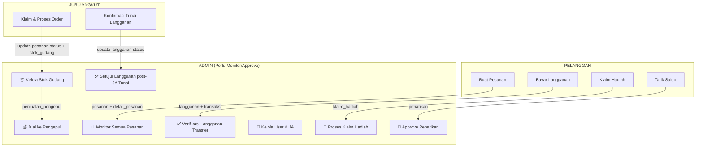

# 🔍 Perbandingan Figma vs Analisa Backend — Admin Panel GoGarbage

---

## 1. Analisa UI/UX Figma

Berikut hasil analisa dari desain Figma di `crowd-post-00104489.figma.site`:

### Sidebar Menu (5 item)
1. **Dashboard**
2. **Data Pengepul**
3. **Transaksi Pengepul**
4. **Monitoring Alur Lengkap**
5. **Stok Sampah Global**

### Halaman per Menu

#### 1️⃣ Dashboard
````carousel

````

- **4 Stat Cards**: Total Pengguna (1.234), Juru Angkut Aktif (45), Pengepul Terdaftar (18), Total Sampah kg (8.456)
- **Line Chart**: "Pertumbuhan Bulanan" — data pengguna & pengepul per bulan (Jan–Mei)
- **Pie Chart**: "Distribusi Jenis Sampah" — Plastik 38%, Kertas 28%, Logam 21%, Kaca 12%

#### 2️⃣ Data Pengepul
````carousel

````

- Tombol **"+ Tambah Pengepul"**
- Card per pengepul: Nama, Alamat, Kontak (telepon + email), Total Transaksi, Total Berat
- Badge status **"Aktif"**
- Tombol **Edit** dan **Detail** per card

#### 3️⃣ Transaksi Pengepul
````carousel

````

- **3 Summary Cards**: 342 (bulan ini), 8.456 kg (bulan ini), Rp 42,3 Juta (bulan ini)
- **Tabel "Riwayat Transaksi"**: ID Transaksi, Tanggal, Juru Angkut, Pengepul, Jenis Sampah, Berat, Harga, Status (Selesai/Proses)

#### 4️⃣ Monitoring Alur Lengkap
- Tidak terlihat detail halaman terpisah di Figma, kemungkinan berupa tracking flow / timeline

#### 5️⃣ Stok Sampah Global
- Tidak terlihat detail halaman terpisah di Figma, kemungkinan berupa tabel/grafik stok per kategori

---

## 2. Re-Analisa Alur Pengguna ↔ Juru Angkut ↔ Database

### Data yang di-INSERT/UPDATE per tahap dan apa yang Admin perlu LIHAT/KELOLA:



### Ringkasan Data yang Masuk ke DB dari Pengguna & JA:

| Sumber | Tabel yang Terisi | Yang Admin Perlu Lakukan |
|--------|-------------------|--------------------------|
| Pelanggan order | `pesanan`, `detail_pesanan` | Monitor status, verifikasi bukti bayar |
| Pelanggan langganan saldo | `langganan`(aktif), `transaksi`(selesai), `users`(saldo-) | Tidak perlu approval |
| Pelanggan langganan transfer | `langganan`(menunggu), `transaksi`(menunggu) | **Verifikasi bukti → setujui/tolak** |
| Pelanggan langganan tunai | `langganan`(menunggu_tunai), `transaksi`(menunggu) | **Setujui setelah JA konfirmasi** |
| JA selesaikan order | `pesanan`(selesai), `users`(saldo+poin), `stok_gudang`(+masuk) | Monitor stok masuk, cek laporan |
| JA konfirmasi tunai | `langganan`(menunggu_tunai→menunggu) | **Approve final** |
| Pelanggan tarik saldo | `penarikan`(menunggu) | **Approve/tolak penarikan** |
| Pelanggan klaim hadiah | `klaim_hadiah`(menunggu) | **Proses klaim** |

---

## 3. Tabel Perbandingan: Figma vs Analisa Backend

| # | Menu Figma | Menu Analisa Backend | Status | Keputusan |
|---|-----------|---------------------|--------|-----------|
| 1 | **Dashboard** | **Dashboard** | ✅ Cocok | **GUNAKAN** — Ambil layout Figma (stat cards + charts), isi dengan data real dari DB |
| 2 | **Data Pengepul** | **Manajemen Pengguna** (termasuk Pengepul) | ⚠️ Sebagian cocok | **PERLUAS** — Figma hanya Data Pengepul, kita perlu juga kelola Pelanggan + Juru Angkut. Jadikan sub-menu "Manajemen Pengguna" |
| 3 | **Transaksi Pengepul** | **Penjualan Pengepul** | ✅ Cocok | **GUNAKAN** — Tabel transaksi Figma cocok dengan tabel `penjualan_pengepul` |
| 4 | **Monitoring Alur Lengkap** | **Pesanan** | ⚠️ Sebagian cocok | **PERLUAS** — Figma mungkin hanya visual flow, kita perlu tabel pesanan + detail + verifikasi |
| 5 | **Stok Sampah Global** | **Stok Gudang** | ✅ Cocok | **GUNAKAN** — Stok per kategori, log masuk/keluar |
| 6 | ❌ Tidak ada di Figma | **Langganan** | 🆕 Perlu ditambah | **TAMBAH** — Verifikasi langganan transfer/tunai, kelola status |
| 7 | ❌ Tidak ada di Figma | **Keuangan** (Penarikan) | 🆕 Perlu ditambah | **TAMBAH** — Approve penarikan saldo user |
| 8 | ❌ Tidak ada di Figma | **Hadiah & Poin** | 🆕 Perlu ditambah | **TAMBAH** — CRUD hadiah + proses klaim |
| 9 | ❌ Tidak ada di Figma | **Master Data** | 🆕 Perlu ditambah | **TAMBAH** — Kelola kategori sampah + paket langganan |

---

## 4. Keputusan Final: Menu Admin yang Diimplementasikan

Berdasarkan perbandingan di atas, berikut menu final yang menggabungkan desain Figma (layout/styling) dengan kebutuhan fungsional backend:

### Sidebar Menu Final

```
📊 Dashboard
👥 Manajemen Pengguna
   ├── Pelanggan
   ├── Juru Angkut
   └── Pengepul           ← dari Figma "Data Pengepul"
📋 Pesanan                ← Figma "Monitoring Alur Lengkap" + diperluas
📦 Langganan              ← BARU (tidak ada di Figma)
💰 Transaksi Pengepul     ← dari Figma
📦 Stok Sampah            ← dari Figma "Stok Sampah Global"
💸 Keuangan               ← BARU
🎁 Hadiah & Poin          ← BARU
⚙️ Master Data            ← BARU
   ├── Kategori Sampah
   └── Paket Langganan
```

### Struktur Folder `views/admin/`

```
views/admin/
├── dashboard/
│   └── index.blade.php          ← Stats, chart, overview
├── pengguna/
│   ├── pelanggan.blade.php      ← List + detail pelanggan
│   ├── juru_angkut.blade.php    ← List + tambah + detail JA
│   └── pengepul.blade.php       ← Dari Figma "Data Pengepul"
├── pesanan/
│   └── index.blade.php          ← Monitoring semua pesanan
├── langganan/
│   └── index.blade.php          ← Verifikasi & kelola langganan
├── transaksi_pengepul/
│   └── index.blade.php          ← Dari Figma "Transaksi Pengepul"
├── stok/
│   └── index.blade.php          ← Dari Figma "Stok Sampah Global"
├── keuangan/
│   └── index.blade.php          ← Penarikan + riwayat transaksi
├── hadiah/
│   └── index.blade.php          ← CRUD hadiah + klaim masuk
└── master_data/
    ├── kategori_sampah.blade.php
    └── paket.blade.php
```

> [!IMPORTANT]
> **Yang diambil dari Figma**: Layout sidebar, stat cards, tabel style, card pengepul, warna hijau GoGarbage.
> **Yang ditambahkan karena alur backend**: Menu Langganan, Keuangan, Hadiah & Poin, Master Data — ini semua belum ada di desain Figma tapi **pasti diperlukan** berdasarkan data yang sudah masuk ke database dari sisi Pengguna & Juru Angkut.
