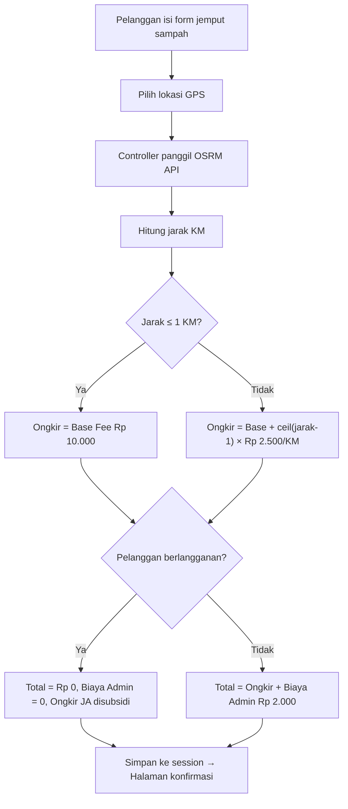

# Walkthrough: Implementasi Ongkir Dinamis Berbasis Jarak (OSRM)

## Ringkasan Perubahan

Sistem biaya jemput sampah yang sebelumnya **statis** (Rp 5.000 dari tabel konfigurasi) kini diganti dengan **kalkulasi ongkir dinamis** berdasarkan jarak real menggunakan OSRM API.

---

## Alur Kerja Baru

---

## File yang Diubah

### Database
| File | Perubahan |
|------|-----------|
| [add_ongkir_columns_to_pesanan.php](file:///d:/Makul/JOKI/gogarbage/database/migrations/2026_05_27_000001_add_ongkir_columns_to_pesanan.php) | **[NEW]** Tambah kolom `jarak_km`, `ongkir_juru_angkut`, `biaya_admin` ke tabel pesanan |
| [KonfigurasiSeeder.php](file:///d:/Makul/JOKI/gogarbage/database/seeders/KonfigurasiSeeder.php) | Ganti config lama (`biaya_jemput`, `komisi_pengangkut_persen`) → config baru (`ongkir_base_fee`, `ongkir_per_km`, `biaya_admin_reguler`, `lat/lon_bank_sampah`) |

### Models
| File | Perubahan |
|------|-----------|
| [Pesanan.php](file:///d:/Makul/JOKI/gogarbage/app/Models/Pesanan.php) | Tambah `jarak_km`, `ongkir_juru_angkut`, `biaya_admin` ke `$fillable` dan `casts()` |

### Controllers
| File | Perubahan |
|------|-----------|
| [JemputSampahController.php](file:///d:/Makul/JOKI/gogarbage/app/Http/Controllers/Pelanggan/JemputSampahController.php) | **Core change:** Tambah method `hitungJarakOSRM()`, `hitungJarakHaversine()` (fallback), `hitungOngkir()`. Method `store()` sekarang call OSRM → hitung ongkir → simpan ke session |
| [OrderController.php](file:///d:/Makul/JOKI/gogarbage/app/Http/Controllers/JuruAngkut/OrderController.php) | `selesaikanOrder()`: Ganti bagi hasil persentase → langsung dari kolom `ongkir_juru_angkut` dan `biaya_admin`. Tambah logika subsidi saldo JA untuk pesanan langganan |
| [KeuanganController.php](file:///d:/Makul/JOKI/gogarbage/app/Http/Controllers/Admin/KeuanganController.php) | Summary cards: `totalKomisiJA` → `totalOngkirJA`, tambah `totalSubsidiOngkir`, `totalBagianPerusahaan` → `totalBiayaAdmin` |
| [KonfigurasiController.php](file:///d:/Makul/JOKI/gogarbage/app/Http/Controllers/Admin/KonfigurasiController.php) | Validasi & simpan config baru (ongkir_base_fee, ongkir_per_km, biaya_admin_reguler, lat/lon_bank_sampah) |

### Views
| File | Perubahan |
|------|-----------|
| [pelanggan/jemput_sampah/index.blade.php](file:///d:/Makul/JOKI/gogarbage/resources/views/pelanggan/jemput_sampah/index.blade.php) | Biaya card: hapus Rp 5.000 statis → "Dihitung otomatis berdasarkan jarak lokasi" |
| [pelanggan/jemput_sampah/konfirmasi_pesanan.blade.php](file:///d:/Makul/JOKI/gogarbage/resources/views/pelanggan/jemput_sampah/konfirmasi_pesanan.blade.php) | Ringkasan: tampilkan breakdown jarak KM, ongkir jemput, biaya layanan, total |
| [admin/keuangan/index.blade.php](file:///d:/Makul/JOKI/gogarbage/resources/views/admin/keuangan/index.blade.php) | Summary cards: "Ongkir JA (Total)" + info subsidi, "Biaya Admin (Total)" |
| [admin/pesanan/index.blade.php](file:///d:/Makul/JOKI/gogarbage/resources/views/admin/pesanan/index.blade.php) | Modal detail: tampil jarak, ongkir JA, biaya admin, label subsidi untuk langganan |
| [admin/konfigurasi/index.blade.php](file:///d:/Makul/JOKI/gogarbage/resources/views/admin/konfigurasi/index.blade.php) | Form baru: Base Ongkir, Tarif/KM, Biaya Admin, Poin, Koordinat Bank Sampah |

---

## Rumus Ongkir

| Kondisi | Formula |
|---------|---------|
| Jarak ≤ 1 KM | `ongkir = base_fee (Rp 10.000)` |
| Jarak > 1 KM | `ongkir = base_fee + ceil(jarak - 1) × per_km (Rp 2.500)` |
| Reguler | `total = ongkir + biaya_admin (Rp 2.000)` |
| Langganan | `total = Rp 0` (ongkir JA disubsidi admin) |

**Contoh:** Jarak 3.2 KM → `10.000 + ceil(2.2) × 2.500 = 10.000 + 7.500 = Rp 17.500` ongkir + Rp 2.000 admin = **Rp 19.500** total.

---

## Verifikasi

- ✅ Migration berhasil (`jarak_km`, `ongkir_juru_angkut`, `biaya_admin` ditambahkan)
- ✅ Seeder berhasil (config lama dihapus, config baru ditambahkan)
- ✅ Routes compile tanpa error
